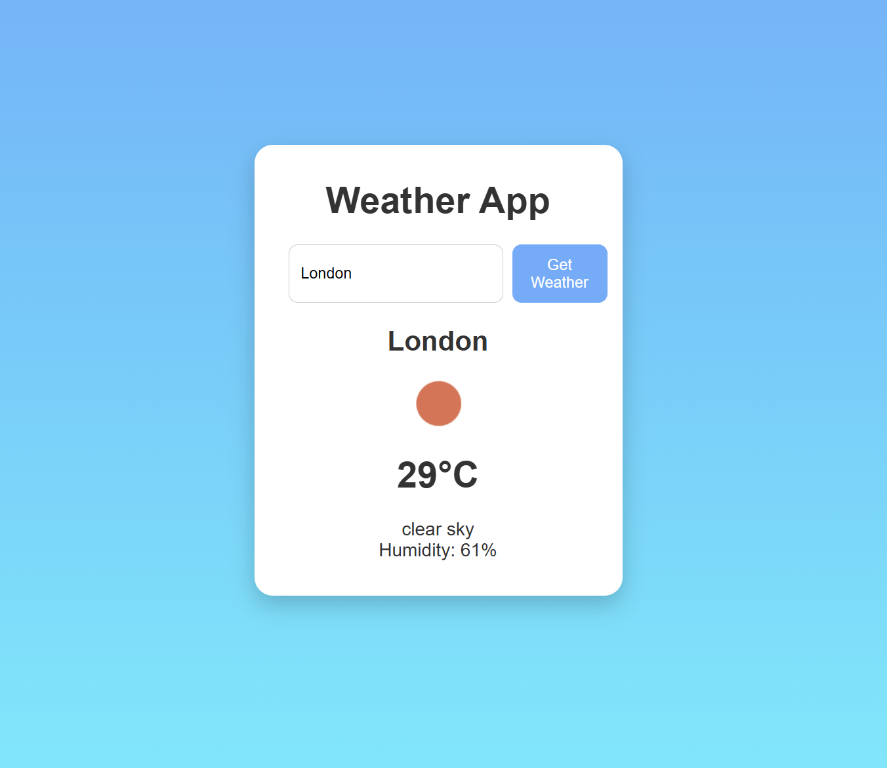

# Weather App 🌤️

A simple web app that shows the current weather for any city. Type in a city name and it fetches live weather data — temperature, conditions, and humidity — from the OpenWeatherMap API.

## 🔗 Live Demo

[View it live here](PASTE_YOUR_NETLIFY_LINK_HERE)

## 📸 Screenshot

## ✨ Features

- Search weather by city name
- Shows temperature in Celsius
- Displays weather conditions with an icon
- Shows humidity
- Press Enter or click the button to search
- Handles errors (empty input, city not found)

## 🛠️ Built With

- HTML
- CSS
- JavaScript
- [OpenWeatherMap API](https://openweathermap.org/api)

## 🚀 How to Run Locally

1. Clone this repo:
2. Open the folder and get a free API key from [OpenWeatherMap](https://openweathermap.org/).
3. In `script.js`, replace `PASTE_YOUR_KEY_HERE` with your own API key.
4. Open `index.html` in your browser.

## 📚 What I Learned

- How to call an external API using `fetch`
- Working with JSON data
- Handling async operations with `async`/`await`
- Basic error handling
- Deploying a static site